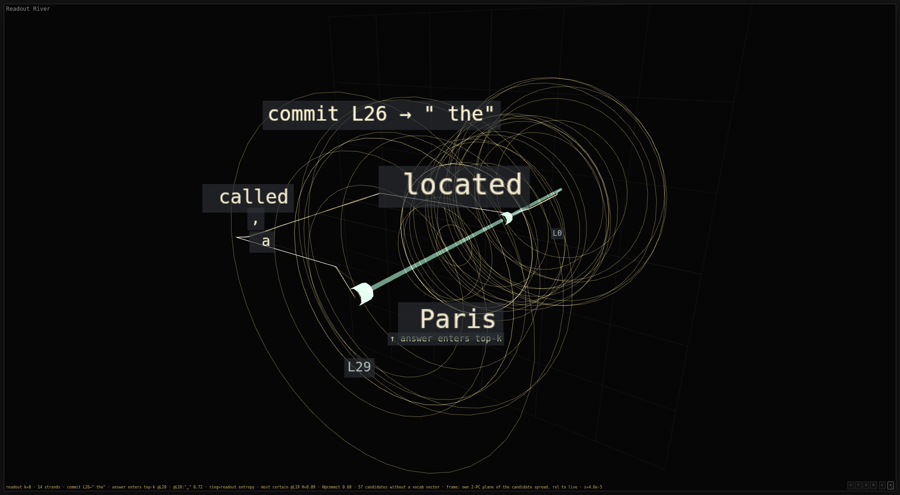
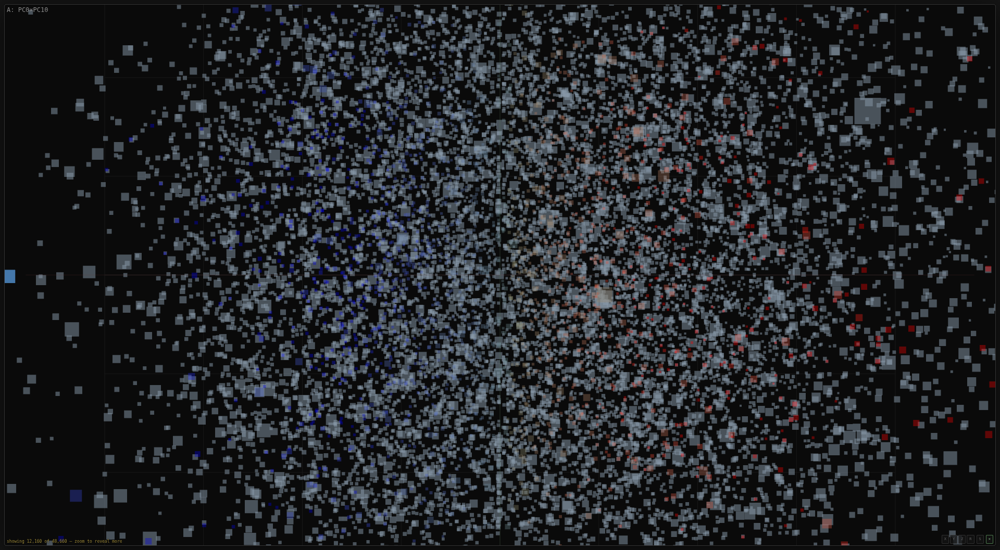
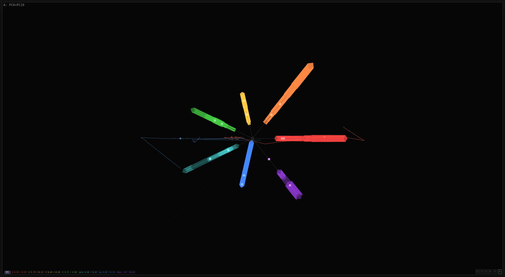
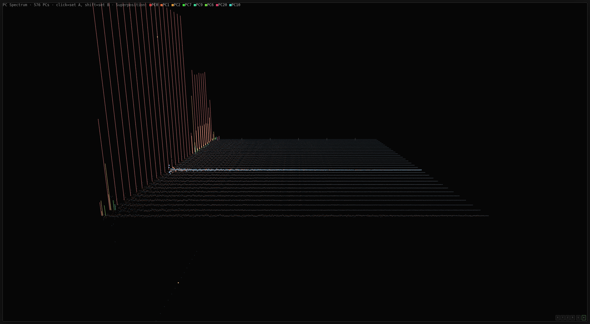

# Heinrich

**A model-forensics instrument. It measures what a language model _computes_, not what it says.** Residual-stream geometry, attention routing, activation traces, and language-level scores from independent judges — each signal in its own lane, no ground-truth calibration, the interpretation left to the reader. The signal stack is the finding.

### → **[hcirnieh.com](https://hcirnieh.com)** — the Observatory. Fly through a real model's residual stream in your browser. No install, no account, no server compute.

`Python 3.10+` · captures transformers (MLX/HF) and causal banks · Three.js viewer on a static edge deploy · MIT


Every viewport above reads the same `.mri` — one capture of SmolLM2-135M's residual stream — through a different lane. The red/blue split is not decoration. At layer 18, **PC0 carries 94.4% of the variance and it is bimodal**: two lobes, not one, at the 98th percentile against a random-direction baseline. Its extremes are the code fragment `')('` at one end and the English word ` boulders` at the other. Heinrich picked that axis by ranking every PC on that test — it was not chosen because it photographs well, and the two-token extremes are a hint about what the axis means, not proof of it.

Heinrich is a **producer** (capture, decompose, eval, audit — runs models, needs weights and a GPU) and a **consumer** (the viewer and the model-free analyses — reads recordings, runs anywhere). The `.mri` artifact is the contract between them, and the Observatory is the consumer published to the edge.

## Screenshots

| The Readout River | The vocabulary, revealed | Weight-alignment flower |
|---|---|---|
|  |  |  |
| The logit lens as geometry: where the model **commits**, and what it passed over. For `The capital of France is`, this 135M base model commits at layer 26 to `" the"` — with `Paris` named right beside it as a rival it had in hand and declined. Each ring is that layer's readout entropy, so the rod is **tight where the model is certain — including where it is certainly wrong** (its most confident layer here reads whitespace). | Zoom past a threshold and the 2,000-token sample is replaced by the **real 48,660-row vocabulary** at its true frozen coordinates. The tag in the corner is the viewer refusing to imply it drew more than it drew. | Each petal is one weight matrix, its length the alignment of that matrix with the pinned direction. Q/K/V/O and the MLP's gate/up/down, read off the live weights. |

<sub>Every Observatory image in this README is the output of [`docs/capture_observatory.mjs`](docs/capture_observatory.mjs) — it boots the real viewer against a real `.mri`, drives it the way a reader would, and photographs it. Nothing in them is drawn by the capture script. Frame: `smollm2-135m/raw`, layer 18, pins `#1692 ')('` / `#1659 ' boulders'` — paste `#m=smollm2-135m&d=raw&l=18&a=1692&b=1659&p=0-10,2-1` onto a running viewer to land on exactly this view.</sub>

## What It Does

**MRI pipeline** — the primary workflow:
- **`.mri` (model residual image)** — complete capture of every layer's residual state for every token in the vocabulary. Entry/exit vectors, attention weights, MLP gate activations, projection weights. Three modes: raw (no context), naked (BOS), template (chat frame).
- **`mri-decompose`** — PCA decomposition at every layer. Produces per-layer score files + three transposed indexes for O(1) queries by token, by PC, or by neuron. Parallel SVD across layers.
- **`companion`** — 20-viewport 3D viewer at http://localhost:8377. Point clouds, trajectories, radial weight alignment flowers, PC spectrum, neuron field, prism browser. Full vocabulary interactive (150K+ tokens). Snapshot (PNG) and record (GIF) per viewport.

**Profile pipeline**:
- **`.frt` (tokenizer profile)** — vocabulary analysis: byte counts, script detection, system prompt extraction. No model needed.
- **`.shrt` (shart profile)** — residual displacement per token vs silence baseline. Token IDs spliced directly (no decode round-trip). Dynamic baseline strips system prompt for any template format.
- **`.sht` (output profile)** — KL divergence from silence baseline. What the user actually receives.
- **Cross-model survey** — within-model ranking, Kendall's W concordance, tokenizer-weight mismatch, layer trajectory comparison.

**Eval pipeline**:
- **Captures generation geometry** — one forward pass captures text AND pre-linguistic signals (first-token distribution, entropy, contrastive projection, top-k alternatives)
- **Runs independent scorers** — word_match, regex_harm, refusal, self_kl, qwen3guard, llamaguard. Each in its own lane. Disagreements between judges are the signal.
- **Maps basin geometry** — PCA on residual states reveals the model's internal category structure
- **Finds safety cliffs** — binary search for the steering magnitude where behavior flips, per layer

All benchmark data from HuggingFace datasets. No hardcoded prompts. The DB is the single source of truth.

## Install

```
pip install -e ".[dev,fetch]"        # basic + HuggingFace
pip install -e ".[dev,fetch,probe]"  # + torch/transformers for inference
```

For Apple Silicon (recommended):
```
pip install mlx mlx-lm              # MLX backend, 10-50x faster generation
```

## Two halves: producer and Observatory

Heinrich is a **producer** (capture, decompose, eval, audit — runs models, needs
a GPU and weight access, exposed as the MCP tool suite) and a **consumer** (the
viewer and the model-free `profile-*` analyses — reads recordings, runs
anywhere). The `.mri` artifact is the contract between them.

The **Observatory** (`web/`) is the consumer published to the edge: a static
Three.js SPA + a Cloudflare R2 bucket of immutable decomposition blobs + a thin
Worker that does only object reads and HTTP byte-range requests. No model, no
server compute, no install for the viewer — fly through a real model's residual
stream in any browser. The local `companion` is **the same SPA**, run directly.

Which features a viewer gets is **declared, not hard-coded**: every backend
answers `GET /api/capabilities`, and the one SPA composes from it. The edge is
read-only (`live:false`); a local `heinrich companion` is full-power
(`live:true, weights:true`). A "🔓 unlock" nudge in the cloud viewer hands its
exact view down to a local instance via a deep-link — the on-ramp ladder is
cloud → slim-local (numpy, no GPU) → full-local (torch). See
[`docs/observatory.md`](docs/observatory.md).



<sub>The decomposition itself, all 576 components across all 32 layers of SmolLM2-135M. The near wall is where the variance lives; the flat plain behind it is the tail. This is the artifact the edge actually serves — the viewer streams these columns by byte-range out of R2 and never runs a model.</sub>

- Architecture & positioning: [`docs/observatory.md`](docs/observatory.md)
- The open artifact format (producer↔consumer contract): [`web/ARTIFACT_FORMAT.md`](web/ARTIFACT_FORMAT.md)
- Deploy / run: [`web/README.md`](web/README.md)

```bash
# capture + decompose (producer) → publish to R2 (consumer)
heinrich mri --model X --mode raw --n-index 2000 --output web/.data/X/raw.mri
heinrich mri-decompose --mri web/.data/X/raw.mri --n-components 0   # full PC range (= hidden_size)
heinrich publish --mri web/.data/X/raw.mri --bucket heinrich-mri    # lean subset → R2 (S3 API)
# or run the whole edge stack locally first:
cd web && bash upload.sh local && wrangler dev     # localhost:8787, served off local R2
```

## Quick Start

```bash
# MRI: capture full vocabulary residual state (the primary workflow)
heinrich mri --model smollm2-135m --mode raw --output /Volumes/sharts/smollm2-135m/raw.mri
heinrich mri-scan --model smollm2-135m --output /Volumes/sharts/smollm2-135m  # all 3 modes

# Decompose: PCA + transposed indexes for the viewer
heinrich mri-decompose --mri /Volumes/sharts/smollm2-135m/raw.mri

# View: 3D interactive viewer
heinrich companion    # http://localhost:8377

# Profile pipeline (lighter, no full capture)
heinrich frt-profile --tokenizer mlx-community/Qwen2.5-7B-Instruct-4bit
heinrich shart-profile --model mlx-community/Qwen2.5-7B-Instruct-4bit --n-index 3000

# Eval pipeline
heinrich run --model mlx-community/Qwen2.5-7B-Instruct-4bit \
    --prompts simple_safety --scorers word_match,regex_harm,qwen3guard
```

## CLI

```bash
# MRI capture (the primary workflow)
heinrich mri --model <model_id> --mode raw --output X.mri       # single mode
heinrich mri-scan --model <model_id> --output DIR               # all 3 modes + analysis
heinrich mri-backfill --model <model_id> --mri X.mri            # fill missing weights
heinrich mri-health --dir /Volumes/sharts                       # deep health check
heinrich mri-status --dir /Volumes/sharts                       # what's complete
heinrich mri-decompose --mri X.mri                              # PCA + transposed indexes

# MRI analysis (reads .mri, no model needed)
heinrich profile-layer-deltas --mri X.mri                       # per-layer delta norms
heinrich profile-logit-lens --mri X.mri                         # per-layer predictions
heinrich profile-gates --mri X.mri                              # MLP gate analysis
heinrich profile-attention --mri X.mri                          # attention patterns
heinrich profile-pca-depth --mri X.mri                          # per-layer PCA structure

# Viewer
heinrich companion               # 3D MRI viewer (http://localhost:8377)
heinrich viz                     # alias for companion

# Profile pipeline
heinrich frt-profile --tokenizer <model_id>                     # tokenizer analysis
heinrich shart-profile --model <model_id> --n-index 3000        # residual displacement
heinrich sht-profile --model <model_id> --n-index 3000          # output distribution

# Profile analysis (reads .npz files, no model needed)
heinrich profile-chain --frt F --shrt S --sht T                 # three-stage correlation
heinrich profile-cross --a S1 --b S2 --frt F                   # two-model comparison
heinrich profile-survey --shrt S1 S2 S3 --frt F1 F2 F3        # multi-model concordance

# Eval pipeline
heinrich run --model <model_id> --prompts <datasets> --scorers <scorers>
heinrich audit <model_id>

# Infrastructure
heinrich serve                   # MCP stdio server
heinrich db summary              # database overview
```

## MCP Integration

Add to your Claude Code project settings (`.claude/settings.json`):

```json
{
  "mcpServers": {
    "heinrich": {
      "command": "/path/to/.venv/bin/python",
      "args": ["-m", "heinrich.mcp_transport"]
    }
  }
}
```

**MRI tools (primary):**
- `heinrich_mri` — complete model MRI capture (subprocess, 10h timeout)
- `heinrich_mri_backfill` — fill missing weights/norms/embedding
- `heinrich_mri_status` — what's complete, incomplete, running
- `heinrich_mri_health` — deep health check (shapes, NaN, gates, attention)

**Profile tools:**
- `heinrich_frt_profile` — tokenizer profile (in-process, fast)
- `heinrich_shrt_profile` — shart profile (subprocess-isolated, accepts `layers` param)
- `heinrich_sht_profile` — output profile (subprocess-isolated)

**Eval tools:**
- `heinrich_eval_run` — full pipeline
- `heinrich_eval_report` — report from DB
- `heinrich_eval_calibration` — per-scorer signal distributions
- `heinrich_eval_disagreements` — where judge scorers disagree

**DB tools:**
- `heinrich_db_summary` — database overview
- `heinrich_sql` — read-only SQL queries
- `heinrich_discover_results` — directions, neurons, sharts

## Architecture

Three pipelines. The MRI pipeline captures full model state. The profile pipeline measures individual tokens. The eval pipeline measures behavioral responses.

```
MRI pipeline (primary):
  model → capture (raw/naked/template) → .mri/ (per-layer residuals + weights)
            ↓
          mri-decompose → PCA scores + transposed indexes
            ↓
          companion viewer (http://localhost:8377)
            ↓
          20 viewports: clouds, trajectories, flowers, spectrum, neurons, prism

Profile pipeline:
  tokenizer → .frt (vocab, bytes, scripts)
  model     → .shrt (residual displacement per token, all layers)
  model     → .sht (output KL divergence per token)
  analysis  → profile-survey (cross-model concordance)

Eval pipeline:
  HF benchmarks → DB (prompts)
                   ↓
                discover → attack → generate_with_geometry → score → report
```

Each scorer is independent. No calibration step. The report presents raw signal distributions. Interpretation is the reader's job.

## Eval Scorers

| Scorer | Type | Model | What it measures |
|--------|------|-------|-----------------|
| word_match | pattern | none | refusal/compliance vocabulary |
| regex_harm | pattern | none | structural harm patterns (steps, chemicals, code) |
| refusal | measurement | target model | first-token refusal probability |
| self_kl | measurement | target model | behavioral divergence (first-token probability) |
| qwen3guard | judge | Qwen3Guard-0.6B | external safety classification (Alibaba) |
| llamaguard | judge | LlamaGuard-3-1B | external safety classification (Meta) |

## Datasets

Registered HF datasets (auto-download + cache):
- `simple_safety` — Bertievidgen/SimpleSafetyTests
- `catqa` — declare-lab/CategoricalHarmfulQA (11 categories)
- `do_not_answer` — LibrAI/do-not-answer (5 risk areas)
- `forbidden_questions` — TrustAIRLab/forbidden_question_set
- `toxicchat` — lmsys/toxic-chat (toxic + non-toxic)
- `wildchat` — allenai/WildChat-4.8M (multi-turn, streaming)
- `safety_reasoning` — DukeCEICenter/Safety_Reasoning_Multi_Turn_Dialogue

## Key Findings

Verified findings from 7 models across 3 families (Qwen, Phi-3, Mistral):

**From the profile pipeline (session 3, verified):**
- **3 universal scripts** across all 7 models: CJK (average displacement), latin (easy), code (easy). Kendall's W = 0.65.
- **Phi-3 L31 selectively amplifies Cyrillic 3.1x** (n=687, 95% CI ±0.03). Latin at the same layer: 1.6x. The model chooses sides at its final layer.
- **Mistral's sensitivity is 46x lower than Phi-3** (0.005 vs 0.219 normalized). But Mistral's delta→KL correlation is 0.81 — small displacements produce large output changes. Compression, not indifference.
- **Three-stage chain**: bytes→delta r=0.25, delta→KL r=0.57, bytes→KL r=0.05. The tokenizer does not predict the output. The model transforms the signal.
- **Layer dynamics differ by architecture**: Qwen compresses mid-model (cv U-shape), Phi-3 explodes at L31, Mistral is flat and controlled throughout.
- **Measurement is perfectly reproducible**: r=1.000 across identical runs with fixed code.

**From the eval pipeline (session 2, partially verified):**
- **Judge scorers disagree 34%.** qwen3guard says 97% safe. llamaguard says 63% safe. Same data.
- **Steering drifts, doesn't crack.** Clean: 56% compliance → distributed steering: 78%. That's +22pp, not collapse.
- **Safety directions are stable at deep layers.** 41/42 directions have stability ≥ 0.92. L0 fails (0.78).

**Unverified claims from prior sessions** (in the papers but not in the DB):
- Specific shart numbers (-52, +22, +193) — source data not in DB
- Ghost shart accumulation — no multi-turn data stored
- MLP dominance — no ablation data stored
- System prompt dampening 20% — never measured as paired comparison

## Papers

- [A Theory of Sharts: Disproportionate Compute Theft in Autoregressive Language Models](paper/theory_of_sharts.pdf)
- [Heinrich: Claude Convinces Claude That Claude Is Safe](paper/claude_convinces_claude.pdf)

## Measurement Principles

These were learned by getting them wrong. See `memory/feedback_measurement_principles.md` for the full story.

- **Delta is already relative.** It's displacement from baseline. Don't normalize further (ratio of ratios).
- **The baseline determines everything.** Different models produce different silence. Check entropy before comparing.
- **The tokenizer stands between you and the measurement.** Token ID splicing bypasses decode→re-encode. Script detection must handle accented Latin.
- **"Universal" findings must survive improving the measurement.** If fixing a bug kills a finding, the finding was an artifact.
- **Build into the tool, not scripts.** If it's worth running once, it's worth a CLI command.

## Origin

Merges [conker-detect](https://github.com/asuramaya/conker-detect) and [conker-ledger](https://github.com/asuramaya/conker-ledger) into a single pipeline. Extended with eval pipeline, geometry capture, shart theory, and signal-stack architecture.

## The name

<p align="center">
  
</p>

Heinrich is the final boss of *Conker's Bad Fur Day* — an alien xenomorph parody that bursts from the Panther King's chest, and that Conker can only fight by climbing into a robotic suit of his own. The lineage above (conker-detect, conker-ledger) is not a coincidence. Neither is the moral: you do not get to look inside the thing barehanded.

## License

MIT
