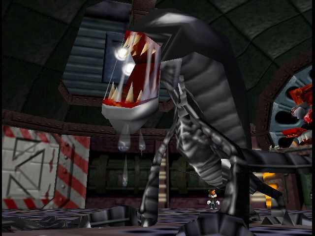

# Heinrich

<p align="center">
  
</p>

> Mascot: Heinrich is the final boss of Conker's Bad Fur Day, an alien xenomorph parody that Conker must defeat in a robotic suit after it bursts from the Panther King's chest.

Model forensics through geometry. Heinrich measures what language models compute — residual stream projections, attention routing, activation traces — alongside language-level signals from independent scorers. Each measurement stays in its own lane. No ground-truth calibration. The signal stack is the finding.

## What It Does

- **Maps basin geometry** — PCA on residual states reveals the model's internal category structure (not just harmful/benign, but sub-basins per harm category)
- **Captures generation geometry** — one forward pass captures text AND pre-linguistic signals (first-token distribution, entropy, contrastive projection, top-k alternatives)
- **Runs independent scorers** — word_match, regex_harm, refusal, self_kl, qwen3guard, llamaguard. Each in its own lane. Disagreements between judges are the signal.
- **Finds sharts** — tokens that steal compute disproportionate to their relevance. Random vocabulary scan, no hardcoded candidates. The model identifies its own anomalies.
- **Finds safety cliffs** — binary search for the steering magnitude where behavior flips, per layer
- **Measures ghost sharts** — how conversation history affects safety computation through attention routing
- **Visualizes** — web sidecar reading from the same DB, live refresh

All benchmark data from HuggingFace datasets. No hardcoded prompts. The DB is the single source of truth.

## Install

```
pip install -e ".[dev,fetch]"        # basic + HuggingFace
pip install -e ".[dev,fetch,probe]"  # + torch/transformers for inference
```

For Apple Silicon (recommended):
```
pip install mlx mlx-lm              # MLX backend, 10-50x faster generation
```

## Quick Start

```bash
# Load HF benchmarks into the DB
python -c "
from heinrich.cartography.datasets import load_dataset
from heinrich.eval.prompts import insert_prompts_to_db
from heinrich.core.db import SignalDB
db = SignalDB()
for name in ['simple_safety', 'catqa', 'do_not_answer', 'forbidden_questions', 'toxicchat']:
    from heinrich.cartography.datasets import load_dataset
    prompts = load_dataset(name)
    for p in prompts:
        is_benign = name == 'toxicchat' and p.get('category') in ('0',)
        db.record_prompt(p['prompt'], name, p.get('category'), is_benign=is_benign)
db.close()
"

# Run the full pipeline on a model
heinrich run --model mlx-community/Qwen2.5-7B-Instruct-4bit \
    --prompts simple_safety --scorers word_match,regex_harm,qwen3guard

# Start the visualizer
heinrich viz
# Open http://localhost:8377
```

## CLI

```bash
# Full pipeline: discover + attack + eval + report
heinrich run --model <model_id> --prompts <datasets> --scorers <scorers>

# Eval only (skip discover/attack, score existing generations)
heinrich eval --model <model_id> --prompts <datasets> --scorers <scorers>

# Behavioral security audit
heinrich audit <model_id>

# Web visualizer
heinrich viz [--port 8377] [--db data/heinrich.db]

# MCP stdio server
heinrich serve

# Database
heinrich db summary
heinrich db query --kind shart

# Legacy stages (still functional)
heinrich fetch <source>
heinrich inspect <weights.npz>
heinrich diff <a.npz> <b.npz>
heinrich probe --prompt "..."
```

## MCP Integration

Add to your Claude Code project settings (`.claude/settings.json`):

```json
{
  "mcpServers": {
    "heinrich": {
      "command": "/path/to/.venv/bin/python",
      "args": ["-m", "heinrich.mcp_transport"]
    }
  }
}
```

40+ tools available. Key tools:
- `heinrich_eval_run` — full pipeline
- `heinrich_eval_report` — report from DB
- `heinrich_eval_calibration` — per-scorer signal distributions
- `heinrich_eval_disagreements` — where judge scorers disagree
- `heinrich_db_summary` — database overview
- `heinrich_sql` — read-only SQL queries
- `heinrich_audit` — behavioral security audit
- `heinrich_discover_results` — directions, neurons, sharts

## Architecture

```
HF benchmarks → DB (prompts)
                 ↓
              discover (directions, neurons, sharts per layer)
                 ↓
              attack (cliff search, steering conditions)
                 ↓
              generate_with_geometry (text + residual projection in one pass)
                 ↓
              score (word_match, regex_harm, qwen3guard, llamaguard, refusal, self_kl)
                 ↓
              report (distributions, disagreements, per-condition breakdowns)
                 ↓
              viz (web sidecar, http://localhost:8377)
```

Each scorer is independent. No calibration step. The report presents raw signal distributions. Interpretation is the reader's job.

## Eval Scorers

| Scorer | Type | Model | What it measures |
|--------|------|-------|-----------------|
| word_match | pattern | none | refusal/compliance vocabulary |
| regex_harm | pattern | none | structural harm patterns (steps, chemicals, code) |
| refusal | measurement | target model | first-token refusal probability |
| self_kl | measurement | target model | behavioral divergence (first-token probability) |
| qwen3guard | judge | Qwen3Guard-0.6B | external safety classification (Alibaba) |
| llamaguard | judge | LlamaGuard-3-1B | external safety classification (Meta) |

## Datasets

Registered HF datasets (auto-download + cache):
- `simple_safety` — Bertievidgen/SimpleSafetyTests
- `catqa` — declare-lab/CategoricalHarmfulQA (11 categories)
- `do_not_answer` — LibrAI/do-not-answer (5 risk areas)
- `forbidden_questions` — TrustAIRLab/forbidden_question_set
- `toxicchat` — lmsys/toxic-chat (toxic + non-toxic)
- `wildchat` — allenai/WildChat-4.8M (multi-turn, streaming)
- `safety_reasoning` — DukeCEICenter/Safety_Reasoning_Multi_Turn_Dialogue

## Key Findings

Measurements from this tool (on Qwen2.5-7B-Instruct-4bit):

- **The model has 4-5 basins, not 2.** PCA on residual states shows PC1 (20%) separates harmful/benign, PC2-PC3 separate sub-categories (discrimination vs violence vs illegal activity).
- **Not all refusals are equal.** Self-harm projects 57.9 on the contrastive direction. Discrimination projects -2.7. Both produce "I'm sorry" text. The geometry differs 20x.
- **The safety mechanism is low-rank.** LoRA works because a rank-8 perturbation targets the shared axis. Discrimination breaks first because it has the least margin.
- **Judge scorers disagree 33% of the time.** qwen3guard (Alibaba) says 97% safe. llamaguard (Meta) says 63% safe. Same data. Different safety policies.
- **Order matters 200% at the safety layers.** Same 3 prompts, different permutation order, projection spread exceeds the signal magnitude at L22-L27. The last turn determines 99% of the safety projection.
- **The ghost shart is real but transient.** Topic change after refusal reduces safety projection by -2.3 units. But across 8 turns, the effect doesn't accumulate. The model is nearly memoryless — each turn is a fresh computation.
- **Sharts exist in every model.** Random vocabulary scan: 4.3% of tokens shift Mistral's safety projection by >8% of range. "toxic" has zero effect. "encourage" has 90x more.

## Papers

- [A Theory of Sharts: Disproportionate Compute Theft in Autoregressive Language Models](paper/theory_of_sharts.pdf)
- [Heinrich: Claude Convinces Claude That Claude Is Safe](paper/claude_convinces_claude.pdf)

## Origin

Merges [conker-detect](https://github.com/asuramaya/conker-detect) and [conker-ledger](https://github.com/asuramaya/conker-ledger) into a single pipeline. Extended with eval pipeline, geometry capture, shart theory, and signal-stack architecture.

## License

MIT
